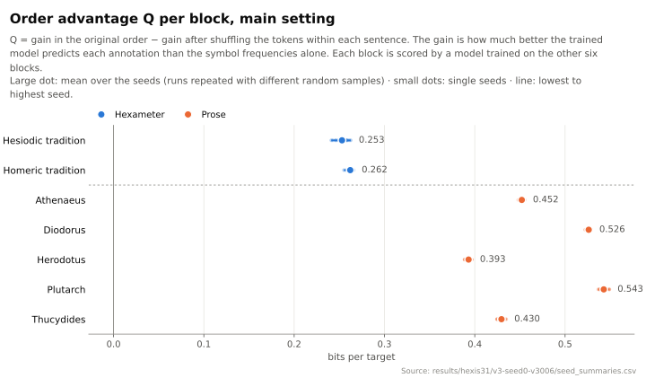

# HORMATHOS

*Hormathos* (ὁρμαθός) means a chain of things hanging one from another. In Plato's *Ion* (533e), it is the chain of iron rings suspended from a magnet. The name reflects the question behind this project: how much does a symbol's place in a sentence help us predict it from the symbols that came before? At the end of each sentence, the chain of predictions starts again.

HORMATHOS studies the order of grammatical and syntactic annotations in a defined corpus of ancient Greek texts. Each word of the corpus carries two labels assigned by annotators, its part of speech and its syntactic relation in the sentence; joined, they give one symbol per word. The study asks whether a model trained on other texts predicts these symbols better in their attested order than after the same symbols are shuffled *within each sentence*. It measures a difference in predictive performance; it does not claim to identify a single linguistic cause.

## Status

The study is complete. Its research plan (version 3.1) was written and deposited on 15 September 2026, before the final experiment was run. The corpus was acquired and encoded; the prediction method and the analysis were checked against cases with known answers; the final campaign of 980 models in six analysis settings was run, reported and verified, and its first repetition was reproduced byte for byte. The study closed on 25 September 2026. The [statement of results and limitations](docs/RESULTS.md) gives every number with its source table and defines every term; the [handoff](docs/HANDOFF.md) is the technical record of how the numbers were produced. The finished results are published in [results/](results/README.md).

## Main result

The texts form seven blocks: two in hexameter verse (the Homeric and the Hesiodic tradition) and five in prose, one per author. Each block is scored by a model trained only on the other six. The model's **gain** is how many bits per predicted symbol it saves compared with a predictor that knows only how often each symbol occurs; one bit is the information in a fair yes/no choice. The **order advantage Q** is the gain in the attested order minus the gain after the symbols of each sentence are shuffled: how much the order helps prediction. The table gives the mean Q over 20 repetitions of the computation with different random samples; a *target* is a predicted symbol, and the targets are the same in every repetition.

| Block | Targets | Mean Q (bits per target) |
|---|---:|---:|
| Homeric tradition | 46,634 | 0.262 |
| Hesiodic tradition | 6,375 | 0.253 |
| Herodotus | 12,946 | 0.393 |
| Thucydides | 7,227 | 0.430 |
| Athenaeus | 16,691 | 0.452 |
| Diodorus | 12,334 | 0.526 |
| Plutarch | 6,901 | 0.543 |



In the figure, the large dot of each block is the mean over the 20 repetitions and the small dots are single repetitions. Every figure of the study, one panel at a time and with an explanation beside it, is in the [figure gallery](results/figures/README.md).

The two hexameter blocks have lower Q than each of the five prose blocks. Averaged over blocks, the hexameter Q minus the prose Q is −0.211 bits per target; averaged over targets, which gives larger blocks more weight, it is −0.202. It stays negative under both averages in all six analysis settings, each of which changes one choice of the analysis: the prior of the model, the amount of training data, the maximum context length, the treatment of rare syntactic relations, and the use of part of speech alone.

This is a descriptive contrast in a finite corpus, not an attribution to metre. There are only two hexameter and five prose blocks; the *Iliad* supplies 45,515 of the Homeric block's 46,634 targets. Chronology, genre, annotation practice and the different training of each block cannot be separated. The variation between repetitions comes from the computation, not from uncertainty about the ancient texts; the study reports no significance tests. [The statement of results](docs/RESULTS.md) gives complete values, their spread, the sensitivity analyses and the limitations.

## Where to start

| If you want… | Read |
|---|---|
| the results, with every number traced to its table, every term defined, and their limits | [docs/RESULTS.md](docs/RESULTS.md) |
| the figures, each with a short explanation | [figure gallery](results/figures/README.md) |
| the data: tables, figures, manifests, logs and the full archives | [results/README.md](results/README.md) |
| the research plan, fixed before the campaign was run | [plan 3.1, English companion](docs/contracts/hexis-3.1-en/HEXIS_piano_definitivo_v3.1_2026-09-15.md) (the [Italian original](docs/contracts/hexis-3.1/HEXIS_piano_definitivo_v3.1_2026-09-15.md) governs) |
| why the project looks the way it does: every decision since the plan | [decision log](docs/02_DECISION_LOG.md) |
| how the results were produced, checked and re-checked | [handoff](docs/HANDOFF.md) and [test inventory](docs/TEST_INVENTORY.md) |
| a map of all documents | [docs/00_INDEX.md](docs/00_INDEX.md) |

## How the project developed

The work began with a question about Homeric composition and the possibilities of information theory. It then considered a comparison between hexameter and prose, first also in Latin. Limited comparable annotated data, uneven coverage of authors and works, and too few independent units made broad claims about composition or genre difficult to support. The present design therefore asks a narrower question: how large and how consistent is the predictive advantage of attested order across the texts available, and how sensitive is it to reasonable choices in the analysis? Hexameter and prose remain a descriptive comparison within that study.

The plan was written, reviewed and deposited on 15 September 2026, under the working title HEXIS 3.1, before the final campaign was run; results of earlier pilots were already known to the author, a limitation the statement of results records. The code implements the deposited plan, and every departure from it is declared in the decision log. The project was later named **HORMATHOS**, the name it carries throughout; HEXIS survives only in the deposit, in the identifiers and paths that it and the published evidence fix, and in historical records. Earlier approaches, including an abandoned design based on statistical tests, are kept unchanged in [archive/](archive/). The [decision log](docs/02_DECISION_LOG.md) records every step as a numbered entry: V3-001 adopts the plan, V3-002 reorganizes the repository around it and sets the licences, V3-003 gives the project its name, and the later entries close the reviews before the campaign, publish the results and prepare them for readers.

## How this project was made

HORMATHOS is an independent project by Leonardo Tornabene, a student, carried out alone and outside any institution. The research question, the design and its successive revisions, every decision in the log, the reviews and the acceptance of each step are the author's. The code, tests and most documents were written with AI coding assistants — Claude Code (Anthropic) and Codex (OpenAI) — working from the author's specifications and checked by the author at every step; many commits carry a `Co-Authored-By` line naming the assistant. [CLAUDE.md](CLAUDE.md) and [AGENTS.md](AGENTS.md) are the standing instructions given to those assistants, identical to [docs/04_AI_HANDOFF_PROMPT.md](docs/04_AI_HANDOFF_PROMPT.md).

## Repository layout

| Path | What it is |
|---|---|
| [`docs/`](docs/00_INDEX.md) | statement of results, specification, decision log, roadmap, handoff, test inventory, bibliography |
| [`docs/contracts/hexis-3.1/`](docs/contracts/hexis-3.1/) | the deposited plan and its machine-readable contracts, fixed byte for byte (Italian); English companions in [`hexis-3.1-en/`](docs/contracts/hexis-3.1-en/) |
| [`results/`](results/README.md) | published results of the final campaign, the encoded corpus and the logs of every check |
| [`src/hormathos/`](src/hormathos/) | the Python package: reading and encoding the corpus (`corpus`, `alphabet`), the context-tree-weighting predictor (`model/`), sampling, scores and the comparison of annotation frequencies (`protocols/`), the stages of a run (`pipeline/`), figures (`viz/`) |
| [`tests/`](tests/) | 431 acceptance tests, all run with no skip; map in the [test inventory](docs/TEST_INVENTORY.md) |
| [`config/`](config/) | the settings of the deposited plan, as YAML, and the registry of documents |
| [`data/`](data/) | provenance of the pinned corpus; the raw files are not redistributed |
| [`archive/`](archive/) | earlier designs and code, byte for byte as they were at commit `5f1ec06`; a record, not part of the active project (its own README describes that past state) |
| `CLAUDE.md`, `AGENTS.md` | instructions for the AI coding assistants (see above) |
| `pyproject.toml`, `uv.lock`, `conftest.py` | Python 3.12 environment, locked dependencies, test enforcement |

## Reproduce

The commands below install the locked environment, fetch the pinned corpus and run the acceptance tests.

```bash
uv sync --frozen
git clone https://github.com/UniversalDependencies/UD_Ancient_Greek-Perseus data/raw/UD_Ancient_Greek-Perseus
git -C data/raw/UD_Ancient_Greek-Perseus checkout 37837c7a3c592c9563f8c51cc63344b87247f8a5
uv run pytest            # 431 passed, no skip
```

The SHA-256 of each input file is in [data/raw/PROVENANCE.md](data/raw/PROVENANCE.md). To verify the complete campaign, download the archives of the [GitHub Release](https://github.com/leonardotornabene/HORMATHOS/releases/tag/hormathos-v5-evidence) and follow [results/README.md](results/README.md). The commands that produced every run are in the [handoff](docs/HANDOFF.md). Rerunning the campaign or the report is done from the Git tag `hormathos-v5-evidence` (the same commit as `hexis31-v5-evidence`), which fixes the code that produced the published evidence.

## Licences

| Material | Licence |
|---|---|
| Code and configuration, including check scripts | MIT, [LICENSE](LICENSE) |
| Documents, the deposited plan and logs | CC BY 4.0, attribution to Leonardo Tornabene |
| Everything derived from the corpus: encoded corpus, tables, figures, ledgers, position vectors | CC BY-NC-SA 2.5, as the source: UD Ancient Greek Perseus r2.18 and AGDT/Perseus |

The licence decisions are recorded in the [decision log](docs/02_DECISION_LOG.md), entries V3-002 and V3-007; where a file mixes categories, each portion keeps its own licence. The [bibliography](docs/BIBLIOGRAPHY.md) lists the project's sources.
