# HORMATHOS figures

The five figures of the final campaign, redrawn for reading: one panel per image, full width, one below the other (V3-009 in the [decision log](../../docs/02_DECISION_LOG.md)). Each panel draws values of the published tables named in its footer and nothing else; the [statement of results](../../docs/RESULTS.md) gives every number with its table and its limits.

These are a presentation. The canonical figures are the five frozen SVGs in [`hexis31/v3-seed0-v3006/`](../README.md#the-final-campaign-hexis31v3-seed0-v3006), recorded with their hashes in the run manifest and unchanged. [`make_figures.py`](make_figures.py) first renders those five again from the published tables with the frozen code and stops unless every byte matches, then draws the panels below.

How to read them: scores are in bits per eligible target. Where seeds are shown, the large dot is the mean across seeds, the small dots are the single seeds and the line is their min–max. Seeds are computational repetitions, not samples of the ancient texts: the line is not a confidence interval, and no figure carries a significance test. Blue marks hexameter (HEX), orange prose (PROSE_ALL), unless the legend says otherwise.

## 1. Corpus and annotation

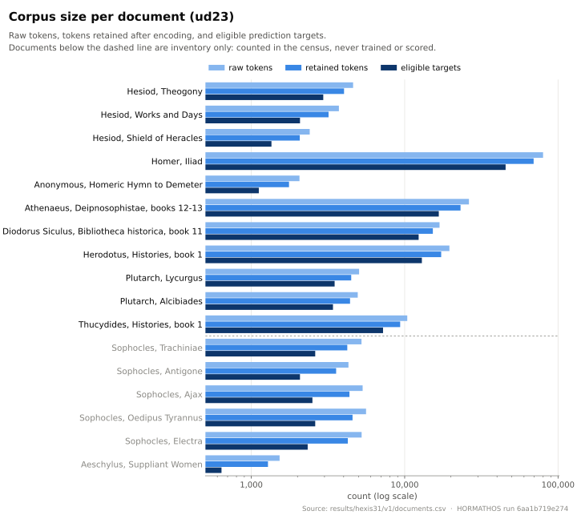

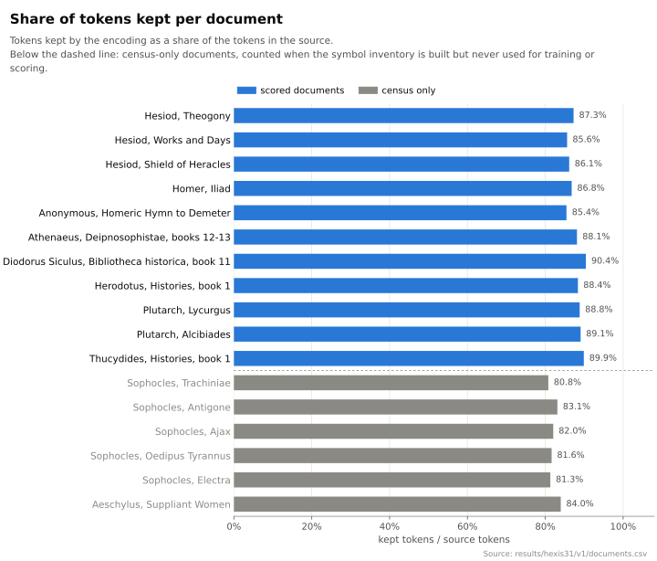

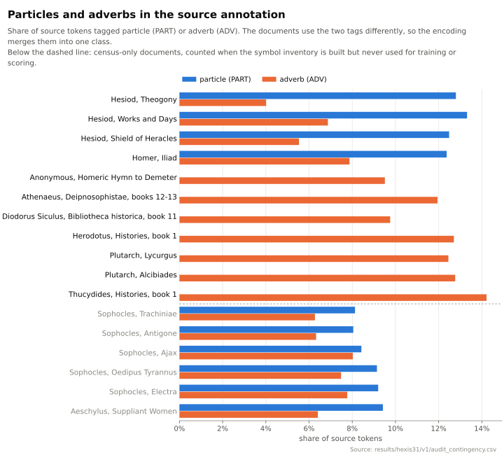

## 2. Block and document profiles

The main result: Q, the order advantage, for each held-out block and each document in the main setting C0.


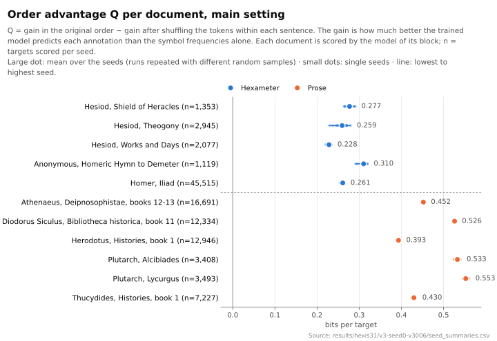

Q is the gain in attested order minus the gain under the within-sentence shuffle. The two gains:

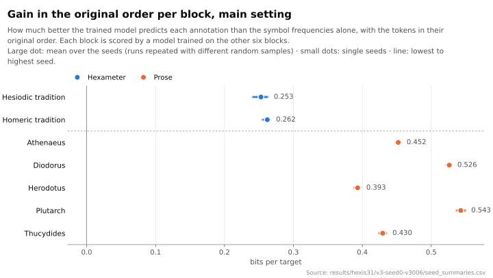

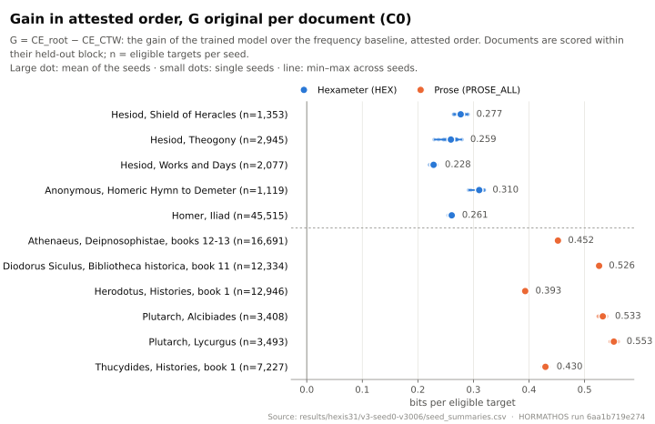

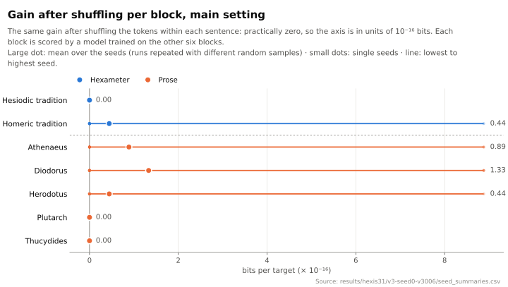

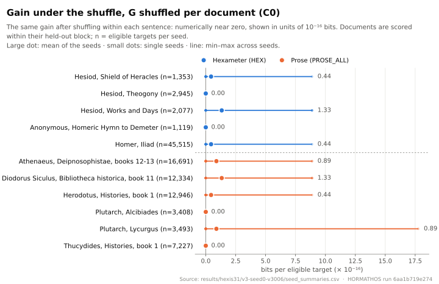

## 3. Sensitivities and the two weightings

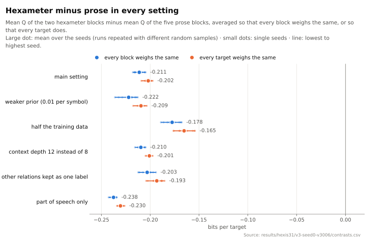

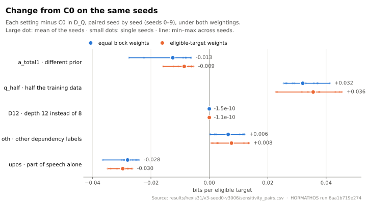

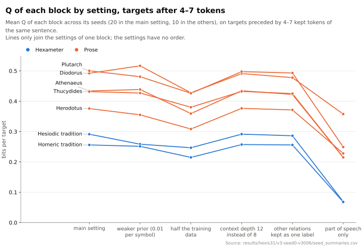

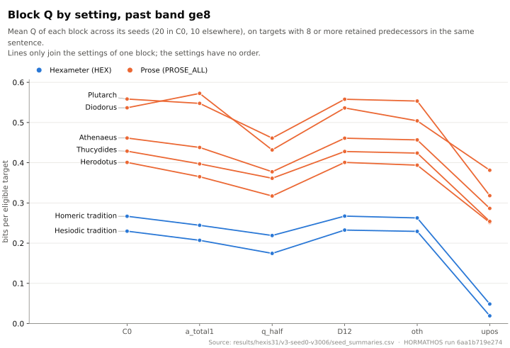

## 4. R1: descriptive divergences between annotation counts

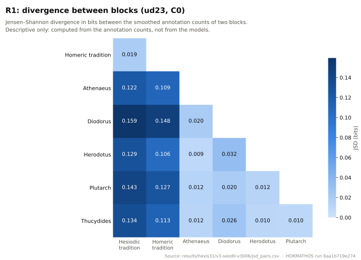

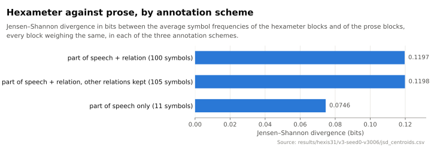

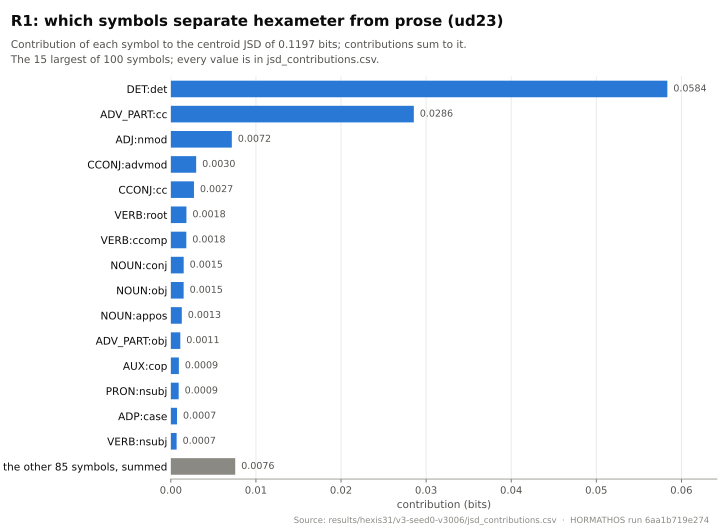

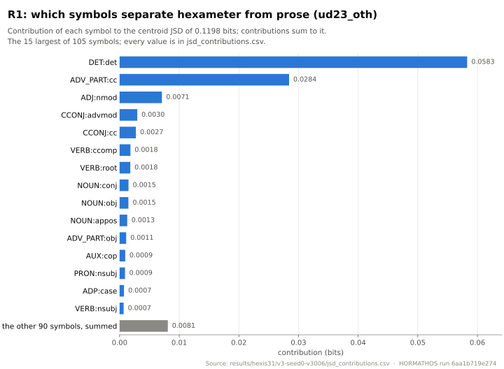

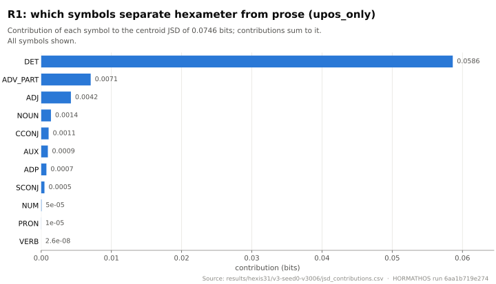

## 5. Model supports and mixture masses

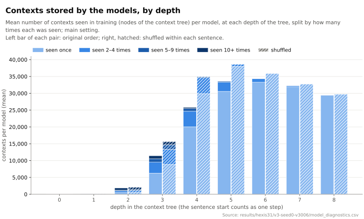

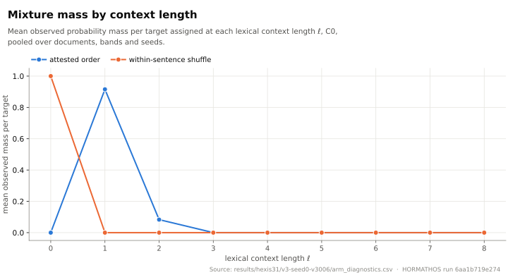

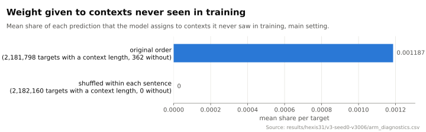

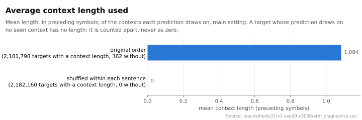

## Regenerate

From the repository root, after `uv sync --frozen`:

```bash
uv run python results/figures/make_figures.py
```

The output is deterministic: a second run writes the same bytes.

## Licence

The figures derive from the corpus and are under CC BY-NC-SA 2.5, as their source, UD Ancient Greek Perseus r2.18 (commit `37837c7a3c592c9563f8c51cc63344b87247f8a5`) and AGDT/Perseus. `make_figures.py` is under MIT; this page under CC BY 4.0, except the corpus-derived values it quotes. See V3-002, V3-007 and V3-009 in the [decision log](../../docs/02_DECISION_LOG.md).
